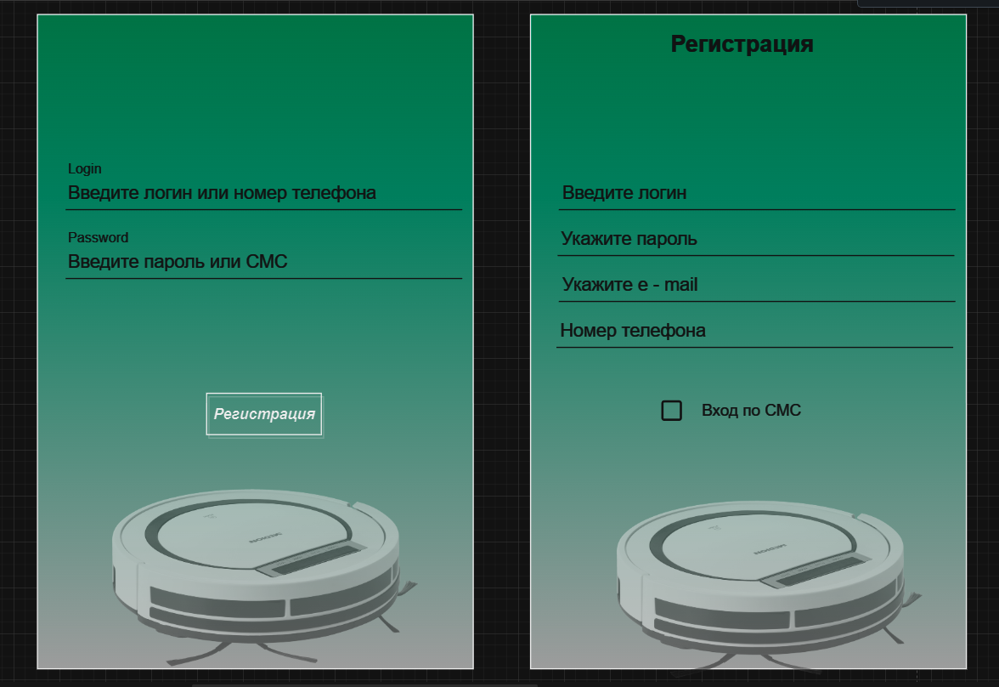
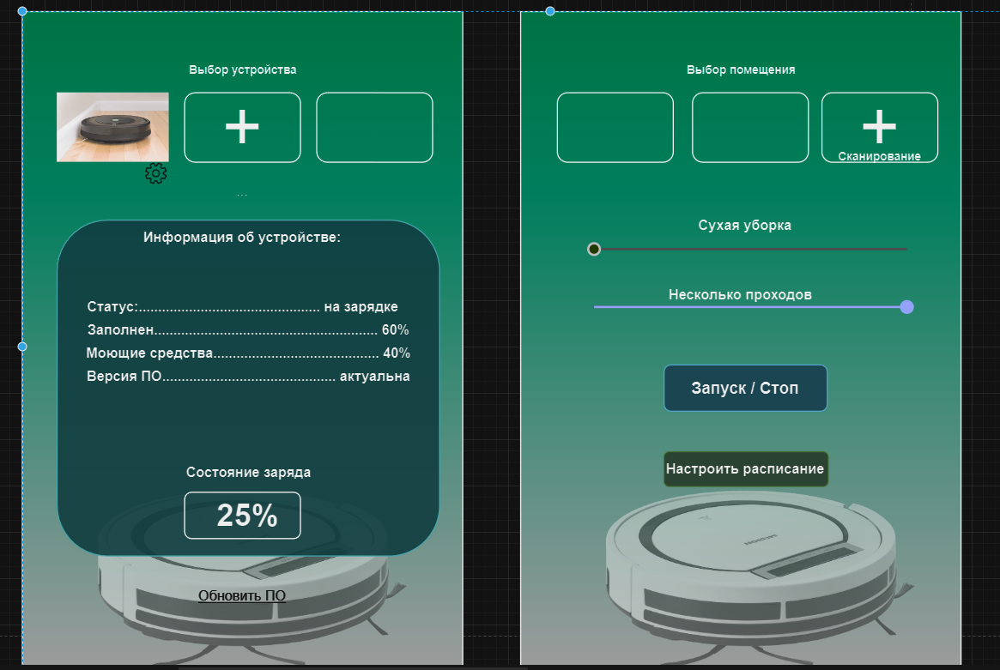
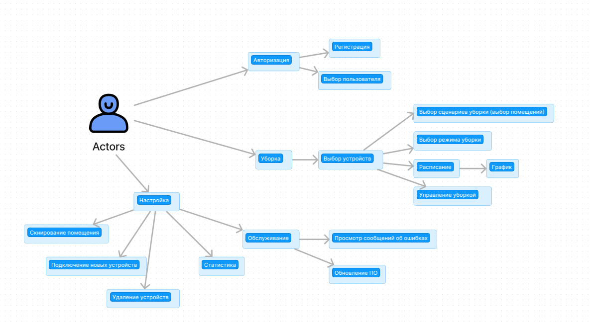
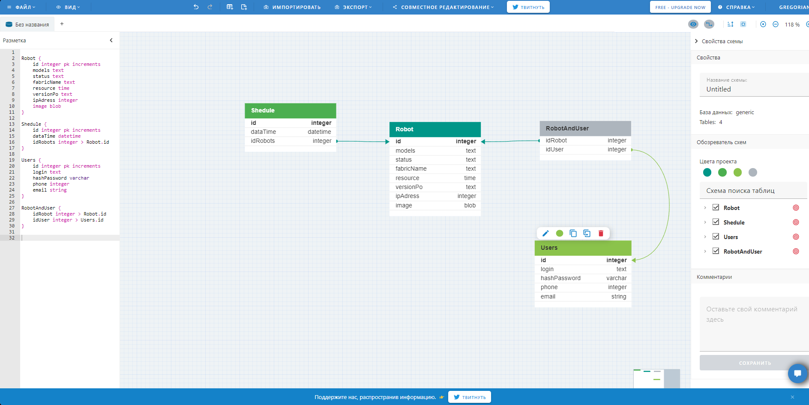

>**Seminar 10. Структура приложения с пользовательским интерфейсом и базой данных**

>**Домашнее залание:** Сквозной проект, блок 1.

>* Спроектировать пользовательский интерфейс (web-SPA, native mobile), основные компоненты (подключение робота, управление помещениями, расписание работы, сервисное обслуживание робота, история уборок)

> Выполнение:

>* Спроектировать доменную модель, в виде текста Домен – атрибуты.
>
> Выполнение:
1. Авторизация
2. Управление
3. Настройка
4. Обслуживание
5. Обновление
6. Состояние

>* Спроектировать сценарии (Use case)(подключение, выбор помещения, программы уборки, настройка расписания, просмотр статистики..), в виде Актор – Прецедент (из первой лекции).

> Выполнение:

>* Спроектировать слой  API Gateway (mobile, web), сформировать REST запросы: GET, POST, PUT, DELETE (https://swagger.io).

> Выполнение:
[Json файл](https://github.com/Gregorian1489/HT010ARCHECTURE/blob/main/openapi.json)

>*  Определить состав информации для кеширования на уровне приложения пользователя, API Gateway, уровня бизнес-логики и уровня репозитория. Список.

> Выполнение:
1. Пароль пользователя
2. Телефон пользователя
3. Почта пользователя

>* Спроектировать ER модель (https://www.dbdesigner.net/), запросы в БД и уровень хранения данных (СУБД).
>
> Выполнение:

